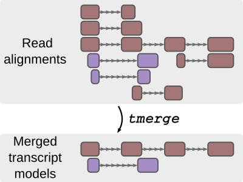
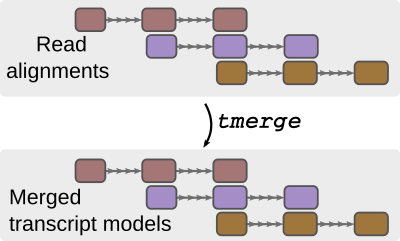
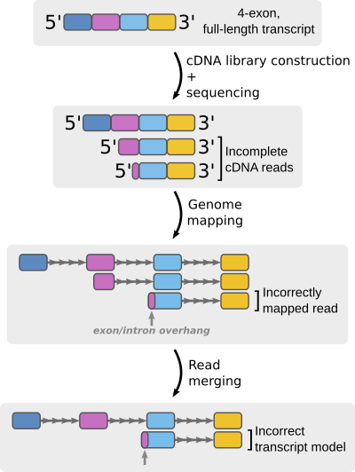
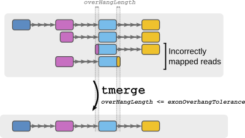

# NAME

tmerge

# SYNOPSIS

Merge transcriptome read-to-genome alignments into non-redundant transcript models.

`tmerge` compares transcript structures (or read-to-genome alignments) present in the input and attempts to reduce transcript redundancy, _i.e._, merge compatible input transcripts into non-redundant transcript models. The program treats spliced and monoexonic reads separately (_i.e._, those are never merged together).

`tmerge` is fast and can typically process several millions of aligned long reads in a few minutes.

See DESCRIPTION below for more details.

**Usage example**:

`tmerge --tmPrefix <custom transcript_id prefix string for output GTF> <input GTF file> > <output file>`

## INPUT

GTF file of read-to-genome alignments, sorted by chromosome and start position.

Only `exon` records are considered.
Read alignments need to be uniquely identified with the `transcript_id` GTF attribute. `transcript_id` is the only mandatory GTF attribute in input records.

## OPTIONS

- `tmPrefix` (string) = Prefix string for `transcript_id` identifiers in the output

    **Default**: '' (empty string)

    By default, output `transcript_id`s consist in arbitrary "`TM_XXXXXXXXXXXX`" strings. If `tmPrefix` is set, its value will prefix all `transcript_id` strings in the GTF output.

- `minReadSupport` (integer) = minimum number of times a read alignment (as defined by its exon/intron structure) needs to be present in the input. In other words, when building a transcript model, only the reads fulfilling the following conditions are considered:

    For **spliced transcripts**, at least `minReadSupport` input reads must share a given intron chain and 5' + 3' ends (+/- `endFuzz` bases, see below).

    For **mono-exonic transcripts**, at least `minReadSupport` input reads must share their 5' + 3' ends (+/- `endFuzz` bases, see below). In other words, when `endFuzz` ` = 0` (the default), only monoexonic reads with identical genome coordinates are merged.

    **Default**: 1

- `endFuzz` (positive integer) = Tolerated fuzziness of 5' and 3' ends for two reads to be considered equivalent when calculating read support (see `minReadSupport` option above)

    **Default**: 0 (i.e., no fuzziness allowed)

- `exonOverhangTolerance` (positive integer) = maximum number of nucleotides of terminal exon overhang allowed within an intron of another transcript during the merging of input reads. See explanation in "DESCRIPTION" below.

    **Default**: 0 (i.e., no exon overhang allowed)

## OUTPUT

`tmerge` outputs non-redundant transcript models (**TMs**) in GTF format. Each TM entry is uniquely identified by its (arbitrary) `transcript_id` attribute.

The `gene_id` attribute has the same value as `transcript_id` by convention; it is therefore meaningless.

The following extra GTF attributes are present in the 9th field, in order:

- `contains` (string): comma-separated list of input reads (`transcript_id`s) contained in the TM, sorted by descending genomic size.
- `contains_count` (integer): number of input reads contained in the TM.
- `3p_dists_to_3p` (string): comma-separated list of the distances (always positive, in bases on mature RNA, i.e. ignoring introns) of the TM's 3' end to each of the input reads 3' ends it `contains`. The list's order follows that of `contains`.
- `5p_dists_to_5p` (string): comma-separated list of the distances (always positive, in bases on mature RNA, i.e. ignoring introns) of the TM's 5' end to each of the input reads 5' ends it `contains`. The list's order follows that of `contains`.
- `flrpm` (float): TM's expression quantification in "Full-Length Reads per Million". This corresponds to `longest_FL_supporters_count` divided by the number of reads (i.e., `transcript_id`'s) present in the input.
- `longest` (string): comma-separated list of the longest read(s) (`transcript_id`s) contained in the TM. This list contains more that one item only in case of length ties. Note that the reads reported do not necessarily cover the entire length of the resulting TM.
- `longest_FL_supporters` (string): comma-separated list of input reads that support `longest` over `longest`'s full-length (+/- `endFuzz`).
- `longest_FL_supporters_count` (integer): number of input reads that support `longest` over `longest`'s full-length (+/- `endFuzz`).
- `mature_RNA_length` (integer): the mature RNA length of the TM (i.e., the sum of the lengths of all its exons)
- `meta_3p_dists_to_5p` (string): comma-separated list of the distances (comprised between 0 and 1, on mature RNA, i.e. ignoring introns) of the TM's **5' end** to each of the input reads 3' ends it `contains`, normalized over the TM's mature RNA length. The list's order follows that of `contains`.
- `meta_5p_dists_to_5p` (string): comma-separated list of the distances (comprised between 0 and 1, on mature RNA, i.e. ignoring introns) of the TM's 5' end to each of the input reads 5' ends it `contains`, normalized over the TM's mature RNA length. The list's order follows that of `contains`.
- `rpm` (float): TM's expression quantification in "Reads per Million". This corresponds to `contains_count` divided by the number of reads (i.e, `transcript_id`'s) present in the input.
- `spliced` (boolean): specifies if the TM is spliced (1) or monoexonic (0).

# DESCRIPTION

`tmerge` reduces redundancy in a set of transcriptome read-to-genome alignments. It does so by looking for reads with _**compatible**_ aligned structures in the input, and merging those into _**Transcript Models**_ (**TMs**).

Pairwise **compatibility** between aligned structures is evaluated using the following rules:

- If both structures are **spliced**, they are deemed compatible if:

    - 1. at least one of their exons overlap on the same genomic strand,
    - 2. either their intron chains are equal, or one is an exact subset of the other,

        and

    - 3. there is no overlap between an exon of one structure and an intron of the other.

    Condition (2) means that `tmerge` will never artificially extend intron chains:

- If both structures are **monoexonic**, they are considered compatible if they overlap by at least 1 nucleotide on the same genomic strand.
- If one structure is **spliced** and the other **monoexonic**, they are not merged.

All pairs of compatible structures are then merged recursively into the longest possible TM.

## `exonOverhangTolerance` option and splice sites

Setting this option to a positive integer can correct mismapped splice junctions that sometimes occur when aligning very short, error-rich terminal read exons:

The setting works as explained below:

 

# AUTHOR

Julien Lagarde, CRG, Barcelona
